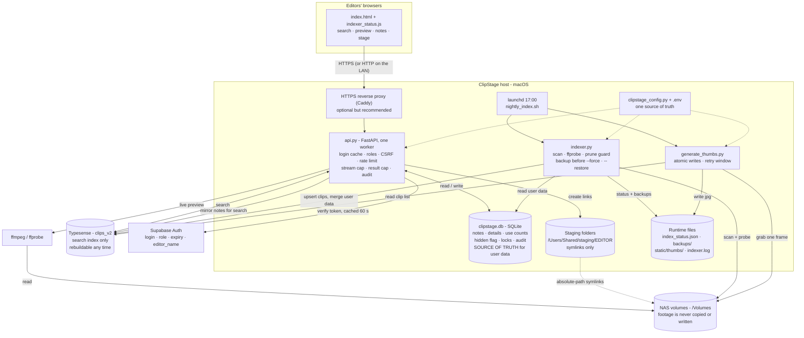

# News Room Clip Archive - ClipStage v5.0

ClipStage is a self-hosted browser application for finding video footage across newsroom NAS
volumes. Editors search the indexed archive, preview clips, add notes and details, and stage the
clips they need into their own folder for editing. Administrators run and monitor the indexer from
the web interface. Footage is never copied or modified: ClipStage only reads the NAS and creates
symlinks.

> **This file describes the tool.** To install it, use the other two guides:
>
> | You have... | Read |
> | --- | --- |
> | A Mac that already runs ClipStage (v3.2, S11 or S12) | [`README-RUNNING-MACHINE.md`](README-RUNNING-MACHINE.md) - upgrade, operate, back up, roll back |
> | A new Mac with nothing installed | [`README-FRESH-INSTALL.md`](README-FRESH-INSTALL.md) - step-by-step first installation |

## Features

- **Word-by-word search** across filename, folder, volume, category, notes and editor details
  (tags, reporter, location, description). Any word order; the last word may be a prefix.
- **Filters and sorting:** by volume, by file size; duration, date and size shown per clip. Very
  large result sets are capped (default 2,000) and the UI says so.
- **Preview:** live FFmpeg transcode, five-minute limit, at most three previews at once
  (configurable).
- **Thumbnails:** one JPEG per clip, generated after the nightly index.
- **Notes and details:** save a note on one clip or on many, and details on one clip. Stored in a
  local database, so a re-index can never lose them.
- **Staging:** symlinks into the editor's folder. Two different clips with the same filename are
  both kept (the second gets a suffix). Only indexed clips can be staged.
- **Warnings:** a clip already staged by another editor; someone else has the clip's notes open.
- **Hide / restore:** an admin can hide a clip from search. It stays hidden after re-indexing and
  can be restored.
- **Audit trail:** logins, staging, notes, hides/restores and indexer runs (admin-readable).
- **Indexer control:** progress, last-run history, and a volume picker (tick one or several volumes) for quick partial re-indexes, and results shown 250 or 500 per page.
- **Safety guards:** the indexer refuses to prune a volume that looks empty or half-mounted, and
  snapshots the index before any rebuild.

## Architecture



The same diagram is in `architecture.mermaid`.

| Piece | Role | Failure behaviour |
| --- | --- | --- |
| `index.html`, `indexer_status.js` | Single-page UI, served by the API | Everything that comes from the NAS is HTML-escaped before display |
| `api.py` | Login, search, notes/details, locks, staging, preview, admin | Starts even when Typesense is down; search then errors until it is back |
| Typesense (`clips_v2`) | Search index only | Rebuildable from the NAS at any time |
| `clipstage.db` (SQLite) | Notes, details, use counts, hidden flags, locks, audit log | **Back this file up** - it cannot be rebuilt |
| Supabase | Who may log in, their role, expiry date and optional editor binding | Login unavailable if unreachable; signed-in users keep working for up to 60 s |
| `indexer.py` | Scans NAS volumes into Typesense | Refuses to prune a suspicious volume; snapshots before `--force` |
| `generate_thumbs.py` | One JPEG per clip | Failures are retried after 7 days; an unmounted volume is never recorded as a failure |
| `clipstage_config.py` | Volumes, extensions, clip-ID hash, collection name, paths | Single source of truth shared by all three programs |
| NAS volumes | The only copy of the footage | Never written to by ClipStage |

## Components

| File | Purpose |
| --- | --- |
| `api.py` | FastAPI application |
| `indexer.py` | Scans volumes into Typesense; prune guard, backups, restore |
| `generate_thumbs.py` | Thumbnail generator (reads the clip list from the index) |
| `clipstage_config.py` | Shared configuration |
| `store.py` | SQLite store for user data |
| `index.html`, `indexer_status.js` | Browser UI (served from `static/` **or** next to `api.py`, whichever is newer) |
| `migrate_to_v2.py` | One-time migration from the old `clips` collection (installs older than v3 only) |
| `editors.json` | Editor names for the staging dropdown (create from `editors.sample.json`) |
| `clipstage_env.sh` | Shared shell setup: safe `.env` loader, Python/Typesense discovery, alerts |
| `clipstage_run.sh` | Runs any Python tool with `.env` loaded: `./clipstage_run.sh indexer.py --dry` |
| `start_clipstage.sh`, `manual_index.sh`, `nightly_index.sh`, `install_nightly.sh`, `com.clipstage.indexer.plist` | Launching and scheduling on macOS |
| `Caddyfile.sample` | HTTPS reverse-proxy example |
| `supabase_profiles_setup.sql` | Profile table and policy for Supabase |
| `.env.sample` | Every setting, documented |
| `tests/` | Automated tests (Python + browser smoke test) |
| Runtime files (Git-ignored) | `.env`, `clipstage.db`, `index_status.json`, `index_dircache.json`, `indexer.log`, `launchd.log`, `backups/`, `static/thumbs/` |

## Where the data lives

| Data | Source of truth | Backup needed? |
| --- | --- | --- |
| Footage: names, sizes, dates | NAS - re-read by the indexer | No |
| Search index | Typesense `clips_v2` | No - rebuildable (but `backups/` snapshots speed recovery) |
| Notes, details, use counts, hidden flags, locks, audit log | **`clipstage.db`** | **Yes - copy it nightly** |
| Accounts, roles, expiry dates | Supabase | Yes (project backup / export) |
| Editor names | `editors.json` | Keep a copy |
| Staged symlinks | `/Users/Shared/staging/<EDITOR>/` | No |

Notes and details are written to SQLite first and mirrored into Typesense so they stay searchable.
If Typesense is briefly down when someone saves a note, the next index run re-syncs the difference.

## Accounts and roles

Supabase Auth owns passwords. The table `public.clipstage_profiles` gives each login a role and an
expiry date, and optionally binds it to one editor name.

- **editor** - search, preview, stage, notes, details.
- **admin** - everything an editor can do, plus hide/restore clips, start index runs and read the
  audit log.
- A profile with `editor_name` can only use that editor's staging folder. A profile without it is a
  shared login that can act as any name in `editors.json`; every action is still audited against the
  real login.
- A profile past its `valid_through` date cannot log in. A revoked or expired account stops working
  within 60 seconds.

## Search rules

Every word must match, in any order, in filename / folder / volume / category / notes / editor
details. Only the **last** word may be a partial prefix (`first laun` finds `Launch_First`;
`fir launch` does not). Names are split on `_ - . ( ) [ ] +`, so `AMMA_UNAVAGAM-LAUNCH.mxf` is
searchable by any of its words. Set `CLIPSTAGE_NUM_TYPOS=1` to tolerate one typo per word.

## Indexing

The Python tools do **not** read `.env` themselves. Run them through `./clipstage_run.sh` (it loads
`.env` first); running `python3 indexer.py` directly fails with `TYPESENSE_KEY environment variable
is required`.

```sh
./clipstage_run.sh indexer.py                  # incremental scan (unchanged folders are skipped)
./clipstage_run.sh indexer.py --dry            # count only, write nothing
./clipstage_run.sh indexer.py --prune          # also remove entries whose file is gone (guarded)
./clipstage_run.sh indexer.py --only PLAYOUT   # one volume
./clipstage_run.sh indexer.py --only EDIT2,PLAYOUT   # a few volumes (comma list)
./clipstage_run.sh indexer.py --full           # ignore the folder cache
./clipstage_run.sh indexer.py --reprobe        # retry duration probing for blank clips
./clipstage_run.sh indexer.py --force          # recreate the collection (snapshot first)
./clipstage_run.sh indexer.py --restore backups/clips_20261001_170000.jsonl
./clipstage_run.sh indexer.py --prune --allow-mass-prune      # override the prune safety limit
```

The nightly job runs `--prune`, then generates up to 5,000 new thumbnails. A full folder rescan is
forced every 7 days per volume.

**Safety built in**

- `--force` first writes `backups/clips_<time>.jsonl` (the newest five are kept). If the snapshot
  cannot be written, the rebuild is aborted before anything is deleted.
- `--prune` is decided **per volume**. If more than `CLIPSTAGE_PRUNE_MAX_PERCENT` (default 5 %) of a
  volume's clips - and more than 50 - look missing, or the scan saw nothing at all, that volume is
  **not** pruned. A warning appears in the UI status line and the nightly job raises an alert.
  Volumes whose scan had read errors are never pruned.
- `--restore` puts a snapshot back and then re-applies the live notes, usage counts and hidden flags
  from SQLite, so a restore can never roll user data back.
- A clip's ID is a hash of its path. Moving or renaming a file creates a new clip; notes stay with
  the old ID.

## Staging

Clips are staged as absolute-path symlinks under `<staging path>/<EDITOR>/`. Editors reach that
folder through the configured SMB share (the Finder action uses `CLIPSTAGE_SMB_HOST`). Symlinks only
work if the SMB server exposes them and the editor's Mac has the NAS volumes mounted under the same
names - **verify this once on a real editor machine.**

## Configuration

All settings live in `.env` (copy `.env.sample`). A variable already set in the shell wins over
`.env`.

| Variable | Default | Purpose |
| --- | --- | --- |
| `TYPESENSE_HOST` / `TYPESENSE_PORT` | `localhost` / `8108` | Typesense address |
| `TYPESENSE_KEY` | **required** | Typesense API key - generate a new random one |
| `SUPABASE_URL`, `SUPABASE_ANON_KEY` | **required** | Supabase login; never the service-role key |
| `CLIPSTAGE_COLLECTION` | `clips_v2` | Search collection name |
| `CLIPSTAGE_VOLUMES_ROOT` | `/Volumes` | Where NAS volumes are mounted |
| `CLIPSTAGE_SCAN_VOLUMES` | `EDIT,EDIT2,INGEST,PLAYOUT,DIGITAL,SHARE FOLDER,TRANSCODER` | Volumes to index, in order |
| `CLIPSTAGE_STAGING_PATH` | `/Users/Shared/staging` | Root of the per-editor staging folders |
| `CLIPSTAGE_THUMB_DIR` | `static/thumbs` | Thumbnail output directory |
| `CLIPSTAGE_DB` | `./clipstage.db` | SQLite file (notes, usage, locks, audit) |
| `CLIPSTAGE_API_PORT` | `8000` | API port |
| `CLIPSTAGE_BIND_HOST` | `127.0.0.1` | Interface the API listens on |
| `CLIPSTAGE_FORWARDED_ALLOW_IPS` | `127.0.0.1` | Proxies trusted to set `X-Forwarded-*` |
| `CLIPSTAGE_COOKIE_SECURE` | `0` | `1` marks the login cookie Secure (use with HTTPS) |
| `CLIPSTAGE_ALLOWED_ORIGINS` | empty | CORS is **off** unless origins are listed |
| `CLIPSTAGE_DOCS` | off | `1` exposes `/docs` |
| `CLIPSTAGE_MAX_RESULTS` | `2000` | Most clips one search returns |
| `CLIPSTAGE_RANK_BUCKETS` | `5` | Best-match ranking: relevance bands; same band → most staged first, then newest (0 = exact ties only) |
| `CLIPSTAGE_MAX_STREAMS` | `3` | Simultaneous previews |
| `CLIPSTAGE_NUM_TYPOS` | `0` | Typo tolerance per word |
| `CLIPSTAGE_SCAN_THREADS`, `CLIPSTAGE_PROBE_THREADS` | `16`, `8` | Indexer parallelism |
| `CLIPSTAGE_PRUNE_MAX_PERCENT` | `5` | Prune refusal threshold per volume |
| `CLIPSTAGE_THUMBS`, `CLIPSTAGE_THUMBS_LIMIT` | `1`, `5000` | Nightly thumbnails on/off, and per-night cap |
| `CLIPSTAGE_THUMB_WORKERS`, `CLIPSTAGE_THUMB_RETRY_DAYS`, `CLIPSTAGE_THUMB_TIMEOUT` | `4`, `7`, `30` | Thumbnail parallelism, retry window, ffmpeg timeout (s) |
| `CLIPSTAGE_ALERT_WEBHOOK` | empty | Slack/Teams/Discord-style webhook for failure alerts |
| `CLIPSTAGE_SMB_HOST` | empty | SMB host used by the Finder action |
| `CLIPSTAGE_PYTHON`, `TYPESENSE_BIN`, `TYPESENSE_DATA_DIR`, `TYPESENSE_LISTEN_ADDRESS` | auto | Overrides for the launch scripts |

## API reference

Interactive documentation at `/docs` when `CLIPSTAGE_DOCS=1`. Every state-changing request must
carry the header `X-ClipStage-CSRF: 1` (the UI does this automatically).

| Method | Path | Who | Purpose |
| --- | --- | --- | --- |
| `GET` | `/` | public | Web interface |
| `GET` | `/health` | public | `{"status":"ok"}` only |
| `GET` | `/static/indexer_status.js` | public | Indexer status widget |
| `POST` | `/auth/login`, `/auth/logout` | public | Sign in / out (login is rate-limited) |
| `GET` | `/config`, `/editors` | login | UI settings; editor names |
| `GET` | `/search?q=` | login | `volume`, `sort`, `page`, `per_page`, `all`; returns `total`, `truncated` |
| `GET` | `/facets/volumes`, `/volumes` | login | Volumes |
| `GET` | `/thumb/{uid}`, `/stream/{uid}` | login | Thumbnail; transcoded preview (429 when all slots are busy) |
| `POST` | `/stage` | login | Stage clip paths (indexed clips only) |
| `GET` / `DELETE` | `/stage/{editor}` | login | List / clear a staging folder |
| `GET` | `/staging/view/{editor}` | login | Staging-folder listing |
| `POST` | `/check-conflicts` | login | Which clips another editor already staged |
| `PATCH` | `/clip/{uid}/notes` | login | Update a note (versioned) |
| `POST` | `/meta/{uid}` | login | Tags, reporter, location, description |
| `POST` | `/clips/bulk-notes` | login | Same note for clip **IDs** |
| `POST` / `DELETE` | `/lock/{uid}` | login | Advisory edit lock (10 minutes) |
| `DELETE` | `/clip/{uid}` | **admin** | Hide a clip from search (reversible) |
| `GET` | `/admin/hidden` | **admin** | List hidden clips |
| `POST` | `/admin/restore/{uid}` | **admin** | Un-hide a clip |
| `GET` | `/admin/audit` | **admin** | Newest audit events |
| `GET` | `/admin/health` | **admin** | Version, collection, document count, mounted volumes |
| `GET` | `/admin/index-status`, `/admin/indexable-volumes` | login | Indexer status |
| `POST` | `/admin/run-indexer` | **admin** | Start a pruned scan (`?volume=` to scope) |

## Security model

- Every route except the login page, `/health`, login/logout and the status script needs a valid
  Supabase session, and the account's profile is re-checked at least every 60 seconds.
- CSRF header on every write; CORS closed by default; login rate-limit; security headers; API docs
  off by default; `/health` reveals nothing about the deployment.
- Staging accepts only clips that are in the index, with editor names validated against path
  tricks; filters and IDs are validated before they reach Typesense or SQLite.
- Everything that originates on the NAS (file names, folders, paths) is HTML-escaped before it is
  shown.
- Typesense listens on `127.0.0.1` when ClipStage starts it. Put an HTTPS proxy in front of the API
  for anything beyond one computer - otherwise passwords and the login cookie cross the LAN in clear
  text. **Do not expose ClipStage to the public internet.**
- `.env` is read by a parser that never executes its contents.

## Testing

```sh
python3 -m pip install -r requirements-dev.txt
python3 -m pytest -q                     # fakes Typesense, Supabase and the NAS; uses real ffmpeg for thumbnails

# optional browser-level check (needs Node): runs the real UI in jsdom with a stubbed network
cd tests && npm install && cd .. && node tests/ui_smoke.mjs
```

The Python tests cover: authorization and CSRF, rate limiting, search, staging safety, SQLite user
data, hide/restore, locks, stream limits, the prune guard, backup/restore, thumbnail generation and
retry rules, the shared configuration, the `.env` loader, script syntax, and packaging hygiene. The
browser test checks that bulk-notes and hide send clip IDs, that hostile file names stay inert, that
every write carries the CSRF header, and that the Sync button honours the volume picker.

They do **not** exercise a real Typesense, a real Supabase, a real NAS, SMB symlink behaviour or a
real browser. See the "Verify" section of either install guide for the one-time live checks.

## Known limitations

- Search ranking is Typesense's; test it once against your real index.
- A clip's ID is a hash of its path: moving or renaming a folder creates new clips without their
  notes.
- Previews are live transcodes: no seeking. Prebuilt proxies would fix this.
- No automatic token refresh: editors sign in again when the Supabase token expires (default one
  hour; raise it in the Supabase Auth settings if editors are interrupted).
- Edit locks, login rate-limits and the login cache live in memory, so run a **single** uvicorn
  worker (the launch script does).
- The UI builds pages from template strings; output is escaped, but a component rewrite would be
  safer long-term.
- macOS only: staging and the Finder action use macOS paths and commands.

## What is new in v5.0

v5.0 is v4.0 with the fixes and UI work found while commissioning a real install. It does **not**
change the search schema or `clipstage.db`, so you can move between v4.0 and v5.0 on the same data.

- **Log out and who-is-signed-in in the header.** Your email, role badge and a **Log out** button are
  always visible. Log out ends the session on the server, revokes it at Supabase, clears the browser's
  saved session and reloads to the sign-in screen. The old "Log in" link is gone.
- **Sync Index follows your role.** The page asks the server who you are (`GET /auth/me`), so an admin
  always sees the volume picker and **Sync Index**; editors never do.
- **Volume picker now works.** Volumes ticked in the picker are sent with Sync Index
  (`/admin/run-indexer?volume=EDIT2,PLAYOUT`). In v4.0 the button ignored the ticks and always ran a full index.
- **Newest UI file wins.** `api.py` serves the newer of `static/indexer_status.js` and the one next to
  it, so an old copy in `static/` can no longer hide an update.
- **`supabase_profiles_setup.sql` drops every old policy** on `clipstage_profiles` (fixes the login
  503 caused by a recursive policy, whatever the policy was called).
- **`clipstage_run.sh`**: run any Python tool with `.env` loaded (`./clipstage_run.sh indexer.py --dry`).
- **Troubleshooting rewritten** from real cases: login 503s, search 503s, `clips` vs `clips_v2`,
  empty editor dropdown, missing Sync Index, `.env` not loaded. See `README-RUNNING-MACHINE.md`, section 6.

## What is new in v4.0

v4.0 is v3.2 (Typesense search, SQLite user data, security hardening) with the operational work
from S12 ported in, plus fixes found while comparing the two.

**Ported from S12**
- Shared `clipstage_config.py`; the API no longer imports the indexer.
- Prune guard (per volume, `CLIPSTAGE_PRUNE_MAX_PERCENT`), snapshot before `--force`, `--restore`,
  and `last_warning` shown in the UI.
- Thumbnail generator: reads the index, atomic writes, `.fail` markers with a retry window,
  fallback for very short clips, `--limit`, `--retry-failed`; the nightly job runs it.
- Safe `.env` loader, failure alerts (macOS notification and optional webhook), `.env` hygiene.
- UI served from `static/` or next to `api.py`, whichever is newer; empty thumbnails treated as
  missing.
- UI fixes: bulk notes and hide send clip IDs, remaining HTML-escaping gaps closed, staging and
  details-save errors are reported instead of ignored.
- Browser smoke test and a much larger automated suite.

**Fixed (present in v3.2)**
- *Bulk notes and hide sent file paths where the API expects clip IDs*, so both failed.
- *The volume picker next to Sync was ignored* - choosing one volume still ran every volume.
- *`.env.sample` listed a real-looking Typesense key.* It now ships a placeholder.
- *`source .env` broke on `SHARE FOLDER`* (the space) and executed whatever followed.

**Deliberately not ported from S12** - v3.2 already does it better: search through Typesense
(not an in-memory copy), SQLite for user data (not fields inside the index), the CSRF header,
login rate-limit, security headers, soft delete, and editor binding through the Supabase profile.
S12's token-protected `/admin/refresh-cache` is not needed because v3 has no in-memory cache.
